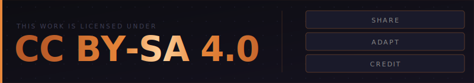

<div align="center">



<br/>

<p>
  
  
  
</p>

<p>🇬🇧 <a href="./README.md">English version</a></p>

</div>

---

## Sommaire

- [Installation](#installation)
- [API](#api)
  - [`writeFileSafe`](#writefilesafepath-content)
  - [`fileExists`](#fileexistspath)
  - [`mkdirSafe`](#mkdirsafepath-deleteifexists)
  - [`deleteFileSafe`](#deletefilesafepath)
  - [`emptyFolderSafe`](#emptyfoldersafepath)
  - [`isEmptySafe`](#isemptysafepath)
  - [`isDirectory`](#isdirectorypath)
  - [`cpSafe`](#cpsafesrc-dest)
  - [`mvSafe`](#mvsafesrc-dest)
  - [`statSafe`](#statsafepath)
  - [`listFilesSafe`](#listfilessafepath)
- [Gestion des erreurs](#gestion-des-erreurs)
- [Tests](#tests)
- [Contributeurs](#contributeurs)
- [Support](#support)
- [Licence](#licence)

---

## Installation

```bash
npm install foxyfs
```

## API

### `writeFileSafe(path, content)`

Écrit `content` (UTF-8) dans `path`, puis vérifie que le fichier est lisible et que son contenu correspond exactement.

```js
import { writeFileSafe } from 'foxyfs';

await writeFileSafe('/tmp/hello.txt', 'Hello world');
```

| Paramètre | Type     | Description                     |
|-----------|----------|---------------------------------|
| `path`    | `String` | Chemin absolu ou relatif        |
| `content` | `String` | Contenu UTF-8 à écrire          |

Lance `Error("Unable to write file")` si l'écriture ou la vérification échoue.

---

### `fileExists(path)`

Retourne `true` si le chemin existe et est lisible, `false` sinon. Ne lève jamais d'erreur.

```js
import { fileExists } from 'foxyfs';

if (await fileExists('/tmp/config.json')) { /* ... */ }
```

**Retourne** `Promise<Boolean>`

---

### `mkdirSafe(path, deleteIfExists?)`

Crée le répertoire (et ses parents) de façon récursive. Si le répertoire existe déjà et `deleteIfExists` vaut `true`, il est supprimé avant d'être recréé.

```js
import { mkdirSafe } from 'foxyfs';

await mkdirSafe('/tmp/a/b/c');
await mkdirSafe('/tmp/output', true); // vide et recrée si déjà présent
```

| Paramètre        | Type      | Défaut  | Description                              |
|------------------|-----------|---------|------------------------------------------|
| `path`           | `String`  | —       | Chemin du répertoire à créer             |
| `deleteIfExists` | `Boolean` | `false` | Supprime le répertoire existant si `true`|

---

### `deleteFileSafe(path)`

Supprime un fichier ou un répertoire (récursivement), puis vérifie qu'il n'existe plus.

```js
import { deleteFileSafe } from 'foxyfs';

await deleteFileSafe('/tmp/old-dir');
```

Lance `Error("Unable to delete file")` si le chemin n'existe pas ou si la suppression échoue.

---

### `emptyFolderSafe(path)`

Supprime tous les enfants directs d'un répertoire sans supprimer le répertoire lui-même, puis vérifie qu'il est vide.

```js
import { emptyFolderSafe } from 'foxyfs';

await emptyFolderSafe('/tmp/cache');
```

Lance une erreur si `path` n'est pas un répertoire ou si le vidage est incomplet.

---

### `isEmptySafe(path)`

Retourne `true` si le fichier a une taille nulle, ou si le répertoire ne contient aucune entrée.

```js
import { isEmptySafe } from 'foxyfs';

const empty = await isEmptySafe('/tmp/output');
```

**Retourne** `Promise<Boolean>`
Lance `Error("Unable to check if path is empty")` si le chemin n'existe pas.

---

### `isDirectory(path)`

Retourne `true` si le chemin pointe vers un répertoire.

```js
import { isDirectory } from 'foxyfs';

const isDir = await isDirectory('/tmp/output');
```

**Retourne** `Promise<Boolean>`
Lance une erreur si le chemin n'existe pas ou n'est pas accessible.

---

### `cpSafe(src, dest)`

Copie un fichier ou un répertoire (récursivement) de `src` vers `dest`. L'original est conservé.

```js
import { cpSafe } from 'foxyfs';

await cpSafe('/tmp/source', '/tmp/backup');
```

Lance `Error("Unable to copy file")` si la source n'existe pas ou si la copie échoue.

---

### `mvSafe(src, dest)`

Déplace un fichier ou un répertoire de `src` vers `dest`. Vérifie que la destination existe et que la source a disparu.

```js
import { mvSafe } from 'foxyfs';

await mvSafe('/tmp/draft.txt', '/tmp/final.txt');
```

Lance `Error("Unable to move file")` si la source n'existe pas ou si le déplacement échoue.

---

### `statSafe(path)`

Retourne l'objet `Stats` de `node:fs` pour le chemin donné, après vérification d'accessibilité.

```js
import { statSafe } from 'foxyfs';

const stats = await statSafe('/tmp/file.txt');
console.log(stats.size, stats.isFile());
```

**Retourne** `Promise<fs.Stats>`
Lance `Error("Unable to stat file")` si le chemin n'existe pas.

---

### `listFilesSafe(path)`

Retourne la liste des noms d'entrées (fichiers et sous-répertoires) dans un répertoire, non récursif.

```js
import { listFilesSafe } from 'foxyfs';

const entries = await listFilesSafe('/tmp/output');
// ['a.txt', 'b.txt', 'subdir']
```

**Retourne** `Promise<Array<String>>`
Lance une erreur si `path` n'est pas un répertoire ou n'existe pas.

---

## Gestion des erreurs

Toutes les fonctions lèvent des erreurs enrichies :

```js
try {
    await deleteFileSafe('/no/such/path');
} catch (err) {
    console.log(err.message);       // "Unable to delete file"
    console.log(err.cause.message); // cause racine chaînée
    console.log(err.data);          // { path: '/no/such/path' }
}
```

La propriété `data` contient le contexte de l'opération (chemin, src/dest, etc.).

## Tests

```bash
npm test
```

Utilise le runner natif `node:test` — aucune dépendance de test externe.

## Contributeurs

[](https://github.com/quentinlamamy)

## Support

[](https://example.com)

## Licence

[](https://creativecommons.org/licenses/by-sa/4.0/)
