<div align="center">



<br/>

<p>
  
  
  
</p>

<p>🇫🇷 <a href="./README.fr.md">Version française</a></p>

</div>

---

## Table of contents

- [Installation](#installation)
- [API](#api)
  - [`writeFileSafe`](#writefilesafepath-content)
  - [`fileExists`](#fileexistspath)
  - [`mkdirSafe`](#mkdirsafepath-deleteifexists)
  - [`deleteFileSafe`](#deletefilesafepath)
  - [`emptyFolderSafe`](#emptyfoldersafepath)
  - [`isEmptySafe`](#isemptysafepath)
  - [`isDirectory`](#isdirectorypath)
  - [`cpSafe`](#cpsafesrc-dest)
  - [`mvSafe`](#mvsafesrc-dest)
  - [`statSafe`](#statsafepath)
  - [`listFilesSafe`](#listfilessafepath)
- [Error handling](#error-handling)
- [Tests](#tests)
- [Contributors](#contributors)
- [Support](#support)
- [License](#license)

---

## Installation

```bash
npm install foxyfs
```

## API

### `writeFileSafe(path, content)`

Writes `content` (UTF-8) to `path`, then verifies the file is readable and its content matches exactly what was written.

```js
import { writeFileSafe } from 'foxyfs';

await writeFileSafe('/tmp/hello.txt', 'Hello world');
```

| Parameter | Type     | Description              |
|-----------|----------|--------------------------|
| `path`    | `String` | Absolute or relative path|
| `content` | `String` | UTF-8 content to write   |

Throws `Error("Unable to write file")` if the write or verification fails.

---

### `fileExists(path)`

Returns `true` if the path exists and is readable, `false` otherwise. Never throws.

```js
import { fileExists } from 'foxyfs';

if (await fileExists('/tmp/config.json')) { /* ... */ }
```

**Returns** `Promise<Boolean>`

---

### `mkdirSafe(path, deleteIfExists?)`

Creates a directory (and its parents) recursively. If the directory already exists and `deleteIfExists` is `true`, it is deleted before being recreated.

```js
import { mkdirSafe } from 'foxyfs';

await mkdirSafe('/tmp/a/b/c');
await mkdirSafe('/tmp/output', true); // wipes and recreates if already present
```

| Parameter        | Type      | Default | Description                                   |
|------------------|-----------|---------|-----------------------------------------------|
| `path`           | `String`  | —       | Path of the directory to create               |
| `deleteIfExists` | `Boolean` | `false` | Delete the existing directory first if `true` |

---

### `deleteFileSafe(path)`

Deletes a file or directory (recursively), then verifies it no longer exists.

```js
import { deleteFileSafe } from 'foxyfs';

await deleteFileSafe('/tmp/old-dir');
```

Throws `Error("Unable to delete file")` if the path does not exist or deletion fails.

---

### `emptyFolderSafe(path)`

Deletes all direct children of a directory without removing the directory itself, then verifies it is empty.

```js
import { emptyFolderSafe } from 'foxyfs';

await emptyFolderSafe('/tmp/cache');
```

Throws if `path` is not a directory or if the emptying is incomplete.

---

### `isEmptySafe(path)`

Returns `true` if a file has zero size, or if a directory contains no entries.

```js
import { isEmptySafe } from 'foxyfs';

const empty = await isEmptySafe('/tmp/output');
```

**Returns** `Promise<Boolean>`
Throws `Error("Unable to check if path is empty")` if the path does not exist.

---

### `isDirectory(path)`

Returns `true` if the path points to a directory.

```js
import { isDirectory } from 'foxyfs';

const isDir = await isDirectory('/tmp/output');
```

**Returns** `Promise<Boolean>`
Throws if the path does not exist or is not accessible.

---

### `cpSafe(src, dest)`

Copies a file or directory (recursively) from `src` to `dest`. The original is preserved.

```js
import { cpSafe } from 'foxyfs';

await cpSafe('/tmp/source', '/tmp/backup');
```

Throws `Error("Unable to copy file")` if the source does not exist or the copy fails.

---

### `mvSafe(src, dest)`

Moves a file or directory from `src` to `dest`. Verifies the destination exists and the source is gone afterwards.

```js
import { mvSafe } from 'foxyfs';

await mvSafe('/tmp/draft.txt', '/tmp/final.txt');
```

Throws `Error("Unable to move file")` if the source does not exist or the move fails.

---

### `statSafe(path)`

Returns the `Stats` object from `node:fs` for the given path, after verifying accessibility.

```js
import { statSafe } from 'foxyfs';

const stats = await statSafe('/tmp/file.txt');
console.log(stats.size, stats.isFile());
```

**Returns** `Promise<fs.Stats>`
Throws `Error("Unable to stat file")` if the path does not exist.

---

### `listFilesSafe(path)`

Returns the list of entry names (files and subdirectories) inside a directory, non-recursive.

```js
import { listFilesSafe } from 'foxyfs';

const entries = await listFilesSafe('/tmp/output');
// ['a.txt', 'b.txt', 'subdir']
```

**Returns** `Promise<Array<String>>`
Throws if `path` is not a directory or does not exist.

---

## Error handling

All functions throw enriched errors:

```js
try {
    await deleteFileSafe('/no/such/path');
} catch (err) {
    console.log(err.message);       // "Unable to delete file"
    console.log(err.cause.message); // chained root cause
    console.log(err.data);          // { path: '/no/such/path' }
}
```

The `data` property contains the operation context (path, src/dest, etc.).

## Tests

```bash
npm test
```

Uses the native `node:test` runner — no external test dependency.

## Contributors

| Name | GitHub | Contact |
|------|--------|---------|
| Quentin Lamamy | [@quentinlamamy](https://github.com/quentinlamamy) | [contact@quentin-lamamy.fr](mailto:contact@quentin-lamamy.fr) |

## Support

If this project is useful to you, you can support its development:

[](https://example.com)

> Support link coming soon.

## License

[CC BY-SA 4.0](https://creativecommons.org/licenses/by-sa/4.0/)
